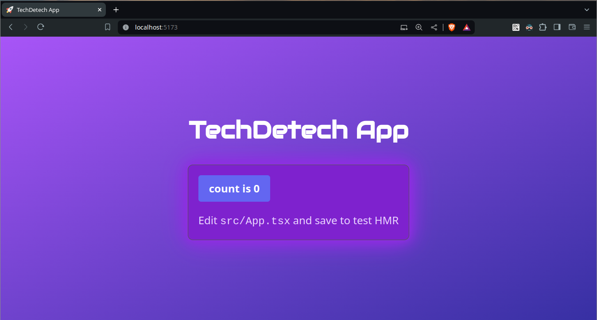

# React + TypeScript + Vite



Recommended tools to build this template:

- [FNM](https://github.com/Schniz/fnm) to handle `Node` versions
- [Yarn Berry](https://yarnpkg.com/migration/guide) as the package manager

This template has the minimal and recommended setup to use:

- TypeScript
- [Tailwind](https://tailwindcss.com/docs/installation)
- [Vite](https://vitejs.dev/guide/) as the local dev server
- [SWC](https://swc.rs/) for Fast Refresh
- [React Router](https://reactrouter.com/en/main/start/overview) for routing
- [React Query](https://tanstack.com/query/latest/docs/framework/react/overview) for data fetch

Also it has configuration to:

- be a Progressive Web App via the [Vite PWA plugin](https://vite-pwa-org.netlify.app/guide/)
- format at `push` with `prettier` and `Github Actions`

Added dependencies:

- [effect](https://effect.website/docs/why-effect): to enhace TypeScript functional patterns
- [unplugin-fonts](https://github.com/cssninjaStudio/unplugin-fonts): to manage fonts

## Instructions

```bash
# For development
yarn --version # It must be `4.2.2`
yarn install # It will use Yarn's PNP
yarn run dev --host
```

### Configure IDE integration

Read the instructions for [`Yarn Berry`](https://yarnpkg.com/getting-started/editor-sdks)

### Add Fonts

1. Add the font description

```ts
// vite.config.ts
export default defineConfig({
  plugins: [
    // other plugins ...
    Unfonts({
      google: {
        families: [
          {
            name: 'Audiowide',
            styles: 'wght@400'
          }
        ]
      }
    })
  ]
})
```

2. Extend the `Tailwind` theme

```js
// tailwind.config.js
export default {
  // other configs ...
  theme: {
    extend: {
      fontFamily: {
        audiowide: ['Audiowide', 'sans-serif']
      }
    }
  }
}
```
